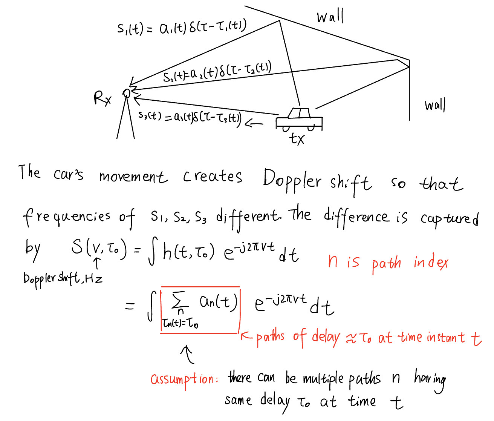

# TX/RX mobility and Doppler effect in multi-path channel
## Preliminary: Doppler shift in signal path

When a transmitter (TX) and receiver (RX) are in relative motion, the received signal frequency shifts from the transmitted frequency — this is the **Doppler effect**.  
In wireless communications, this shift depends on the **geometry of each propagation path** and **which parts of the channel are moving**.

---

### 1. Basic Doppler shift formula

For a single path arriving at an angle $\theta$ relative to the direction of motion, the Doppler shift is:

$$
f\_d = \frac{v}{\lambda} \cos(\theta) = f\_m \cos(\theta)
$$

where:
- $v$ = relative speed between the *wavefront source* and the observer along the path direction
- $\lambda$ = carrier wavelength
- $f\_m = v / \lambda$ = **maximum Doppler shift**
- $\theta$ = angle between the velocity vector and the **direction of wave arrival/departure**

---

### 2. Determining $\theta$ for different mobility cases

The key is identifying **whose motion matters** and **which segment of the path** determines the shift.

| **Case**                     | **Doppler shift for a given NLOS path**                                                                                               | **Governing angle $\theta$**                                                                                                                              |
|------------------------------|---------------------------------------------------------------------------------------------------------------------------------------|-----------------------------------------------------------------------------------------------------------------------------------------------------------|
| **RX moving, TX stationary** | Shift occurs at RX.                                                                                                                   $f\_d = \frac{v\_R}{\lambda} \cos(\theta\_R)$                                                                      | $\theta\_R$ = angle between **RX velocity vector** and **direction from last scatterer to RX** (arrival angle).                                           |
| **TX moving, RX stationary** | Shift occurs at TX → carried through reflection.                                                                                      $f\_d = \frac{v\_T}{\lambda} \cos(\theta\_T)$                                                                      | $\theta\_T$ = angle between **TX velocity vector** and **direction from TX to first scatterer** (departure angle).                                        |
| **Both TX and RX moving**    | Shift = sum of TX contribution + RX contribution.                                                                                     $f\_d = \frac{1}{\lambda} \big[ v\_T \cos(\theta\_T) + v\_R \cos(\theta\_R) \big]$                                | $\theta\_T$ = TX→first scatterer angle relative to TX motion. $\theta\_R$ = last scatterer→RX angle relative to RX motion.                             |
| **Moving scatterer(s)**      | Each moving segment adds its own term. For one moving scatterer: $f\_d = \frac{1}{\lambda} \big[ v\_S(\cos\alpha + \cos\beta) \big]$ | $\alpha$ = angle between scatterer velocity and scatterer→TX direction. $\beta$ = angle between scatterer velocity and scatterer→RX direction.          |

When we talk about the **Doppler spectrum** at a fixed delay, we’re implicitly grouping together **multiple multipath components that have approximately the same propagation delay**.

Let’s unpack this carefully and see *why* this makes sense, physically and mathematically.

## 🔹 0. Reminder of the impulse response of a Linear-Time Variant channel, $h(t,\tau)$

$$
h(t,\tau) = \text{impulse response of the channel at time } t \text{ for delay } \tau
$$

It tells us:

> If an impulse were sent at time $t-\tau$, how much of it arrives at time $t$ after traveling for $\tau$ seconds?

---

## 🔹 1. Recall what $h(t,\tau)$ represents

$$
h(t, \tau) = \sum_{n} a_n(t) \, \delta(\tau - \tau_n(t))
$$

for discrete multipaths.

Here:

- $a_n(t)$: complex amplitude (with time-varying phase and magnitude) of path $n$  
- $\tau_n(t)$: its propagation delay at time $t$

---

## 🔹 2. Fix $\tau$, vary $t$

When we fix $\tau = \tau_0$ and look at $h(t, \tau_0)$:

$$
h(t, \tau_0) = \sum_{n: \tau_n(t) \approx \tau_0} a_n(t)
$$

So indeed — we’re summing the contributions from *all multipath components whose delays fall near* $\tau_0$.

That’s why you’re right:

> The Doppler spectrum for a given delay bin assumes that there are **many components arriving around that delay**, not just one.

---

## 🔹 3. Doppler spectrum definition

The **Doppler spectrum** at delay $\tau_0$ is the Fourier transform of $h(t, \tau_0)$ with respect to $t$:

$$
S(\nu, \tau_0) = \int h(t, \tau_0) \, e^{-j 2\pi \nu t} \, dt
$$

This gives the **distribution of Doppler shifts** (frequency offsets) among all those components near $\tau_0$.

If there’s only *one* component at that delay (say, a single specular path), $S(\nu, \tau_0)$ collapses to a delta spike at its Doppler frequency $f_{D,n}$.  
But usually, in a real environment, many scatterers produce similar path lengths → **their Doppler shifts differ slightly**, leading to a *spread* of Doppler frequencies.

---

## 🔹 4. The “bins” interpretation in practice

In wideband channel measurements, we don’t have infinite delay resolution — so we discretize delays into small bins (say, $1/B$ seconds wide, where $B$ is bandwidth).

Each bin collects many nearby paths:

$$
h(t, \tau_k) = \sum_{n \in \text{paths near } \tau_k} a_n(t)
$$

Then for each bin, we compute the Fourier transform across time $t$ to obtain a **local Doppler spectrum**.

That’s exactly what gives us the **delay–Doppler spread function**:

$$
S(\tau, \nu) = \int h(t, \tau) \, e^{-j2\pi\nu t} \, dt
$$

---

## 🔹 5. Physical intuition

- Fixing $\tau$ groups **paths of similar length** (≈ same delay).  
- Fourier transforming over $t$ reveals how **their combined energy** is distributed over Doppler frequencies (due to relative motion).  
- The width of that Doppler distribution = **Doppler spread** for that delay bin.

## 🔹 6. Example

