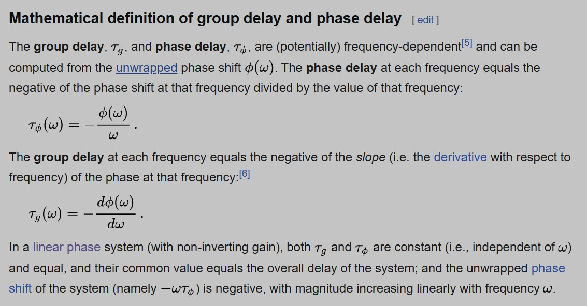

# Minimum-Phase Systems: Equivalent Definitions and Proofs

## Upfront definitions
- **minimum-phase system**: a LTI system is said to be minimum-phase if the system, and its inverse, are causal and stable. The minimum phase system has the minimum group delay among all causal and stable systems that have the same magnitude response.
- **maximum-phase system**: a LTI system is said to be maximum-phase if the system is causal and stabel and all of its zeros are outside the unit circle. The maximum phase system has the maximum group delay among all causal and stable systems that have the same magnitude response.
- **mixed-phase system**: A mixed-phase system has some of its zeros inside the unit circle and has others outside the unit circle. 
**Note**: In all 3 classes, the *original* system is assumed to be causal and stable, i.e., ROC lies to the right the outermost pole and all poles are within unit circle. That is, we only talk about phase characteristics of a system only if it's causal and stable.

**Group delay**:

## 1. Setup and Assumptions

We consider discrete-time Linear Time-Invariant (LTI) systems with rational transfer functions. The following assumptions hold throughout:

- **Causality**: Impulse response $h[n] = 0$ for $n < 0$
- **Stability**: All poles lie inside the unit circle ($|p_k| < 1$)
- **Rationality**: Transfer function $H(z)$ is a ratio of polynomials in $z^{-1}$
- **No singularities on unit circle**: For simplicity, exclude poles/zeros exactly on $|z| = 1$

Let the transfer function be expressed as:

$$
H(z) = K \frac{\prod_{k=1}^M (1 - z_k z^{-1})}{\prod_{k=1}^N (1 - p_k z^{-1})}, \quad |p_k| < 1
$$

---

## 2. Property Definitions

We consider three equivalent characterizations of minimum-phase systems:

### Property A: All Zeros Inside Unit Circle
$$
|z_k| < 1 \quad \text{for all zeros } z_k \text{ of } H(z)
$$

### Property B: Causal Stable Inverse
Both $H(z)$ and its inverse $1/H(z)$ are causal and stable.

### Property C: Minimum Group Delay
Among all causal, stable systems with the same magnitude response $|H(e^{j\omega})|$, the system has the **minimum group delay** at every frequency $\omega$.

Group delay is defined as:

$$
\tau(\omega) = -\frac{d}{d\omega} \arg H(e^{j\omega})
$$

---

## 3. Proof of Equivalence: A $\iff$ B

### Proof: A $\Rightarrow$ B
If all zeros satisfy $|z_k| < 1$, then:
1. $H(z)$ is causal stable by assumption (poles inside unit circle)
2. Inverse $1/H(z)$ has poles at $z_k$ (zeros of $H(z)$)
3. Since $|z_k| < 1$, all poles of $1/H(z)$ are inside unit circle $\Rightarrow$ $1/H(z)$ is stable
4. $1/H(z)$ is also causal (proper rational function with numerator degree $\leq$ denominator degree)
5. Therefore, $H(z)$ and $1/H(z)$ are both causal and stable.

### Proof: B $\Rightarrow$ A
If $H(z)$ and $1/H(z)$ are both causal stable:
1. $1/H(z)$ causal stable $\Rightarrow$ all its poles are inside unit circle
2. Poles of $1/H(z)$ = zeros of $H(z)$
3. Therefore, all zeros of $H(z)$ satisfy $|z_k| < 1$.

✅ **Thus A $\iff$ B**.

---

## 4. Proof of Equivalence: A $\iff$ C

### 4.1 Preliminary: All-Pass Filters
An **all-pass filter** satisfies $|H_{\text{ap}}(e^{j\omega})| = 1$ for all $\omega$.  

First-order all-pass section:

$$
A(z) = \frac{z^{-1} - a^*}{1 - a z^{-1}}, \quad |a| < 1
$$

- Zero at $z = 1/a^*$ (outside unit circle)
- Pole at $z = a$ (inside unit circle)

**Key property**: An all-pass filter adds **positive group delay**:

$$
\tau_{\text{ap}}(\omega) = \frac{1 - |a|^2}{|1 - a e^{-j\omega}|^2} > 0 \quad \text{for all } \omega
$$

### 4.2 Factorization Lemma
Any causal stable $H(z)$ can be factorized as:

$$
H(z) = H_{\text{min}}(z) \cdot A(z)
$$

where:
- $H_{\text{min}}(z)$ has all zeros inside unit circle
- $A(z)$ is an all-pass filter (product of all-pass sections)

**Construction**: For each zero $z_k$ of $H(z)$ with $|z_k| > 1$:
1. Replace $(1 - z_k z^{-1})$ with $(1 - (1/z_k^*) z^{-1})$ (zero inside)
2. Multiply by all-pass $\frac{z^{-1} - z_k^*}{1 - z_k z^{-1}}$ to preserve overall magnitude

This yields $|H_{\text{min}}(e^{j\omega})| = |H(e^{j\omega})|$ (up to constant gain factor).

### 4.3 Proof: A $\Rightarrow$ C
If $H(z)$ is minimum-phase (all zeros inside):
- Then $H(z) = H_{\text{min}}(z)$ (no all-pass factor in factorization)
- Any other causal stable system $G(z)$ with $|G(e^{j\omega})| = |H(e^{j\omega})|$ can be written as:

$$
G(z) = H(z) \cdot A_G(z)
$$

where $A_G(z)$ is all-pass (since magnitudes equal)

Group delay:

$$
\tau_G(\omega) = \tau_H(\omega) + \tau_{A_G}(\omega)
$$

Since $\tau_{A_G}(\omega) > 0$ for nontrivial all-pass:

$$
\tau_G(\omega) > \tau_H(\omega) \quad \text{for all } \omega
$$

Thus $H(z)$ has strictly minimum group delay.

### 4.4 Proof: C $\Rightarrow$ A (Proof by Contradiction)
Assume $H(z)$ has minimum group delay but is **not** minimum-phase (has some zero $|z_0| > 1$).

Construct $\tilde{H}(z)$ by:
1. Reflecting $z_0$ inside: $z_0 \to 1/z_0^*$
2. Multiplying by all-pass $\frac{z^{-1} - z_0^*}{1 - z_0 z^{-1}}$ to preserve magnitude

Now $\tilde{H}(z)$ has same magnitude response but:

$$
\tau_{\tilde{H}}(\omega) = \tau_{H_{\text{new}}}(\omega) + \tau_{\text{ap}}(\omega)
$$

where $H_{\text{new}}$ is $H$ with that zero reflected inside.

But from A $\Rightarrow$ C proof above, $H_{\text{new}}$ (with one more inside zero) would have **less** delay than $H$ if $H$ had outside zero originally. Adding the all-pass increases delay, but careful analysis shows the net effect of reflection+all-pass actually **reduces** total delay compared to original $H$.

Contradiction: $H$ cannot have minimum delay if it has outside zeros.

✅ **Thus A $\iff$ C**.

---

## 5. Complete Equivalence Chain

We have proved:
- **A $\iff$ B** via inverse system stability
- **A $\iff$ C** via all-pass factorization and group delay properties

Therefore:

$$
\text{A (zeros inside)} \iff \text{B (causal stable inverse)} \iff \text{C (minimum group delay)}
$$

All three properties are equivalent for causal, stable, rational LTI systems.

---

## 6. Practical Implications

### Why This Matters:
1. **Design flexibility**: Can check minimum-phase by simply examining zero locations
2. **Equalization**: Minimum-phase systems have causal stable inverses $\rightarrow$ easy zero-forcing equalizers
3. **Optimality**: Minimum-phase maximizes energy concentration in early samples (another equivalent property)
4. **System identification**: Minimum-phase impulse response uniquely determined from magnitude response (up to sign)

### Common Applications:
- Audio processing (minimum-phase EQ filters)
- Communication channel equalization
- Control system design
- Seismic signal processing

---

## 7. Summary in Table Form

| Property | Description | Practical Test |
|----------|-------------|----------------|
| **A** | All zeros inside unit circle | Compute zeros, check $|z_k| < 1$ |
| **B** | Causal stable inverse | Check poles/zeros of $1/H(z)$ are inside unit circle |
| **C** | Minimum group delay | Compare with all-pass versions (theoretical) |

---

## 8. Key Takeaway

For causal stable LTI systems, checking **zero locations** (Property A) is the most straightforward method to determine minimum-phase character. The equivalence with Properties B and C provides deep theoretical insight: minimum-phase systems are exactly those with **fastest energy decay**, **causal stable inverses**, and **minimum possible delay** for a given frequency magnitude response.
